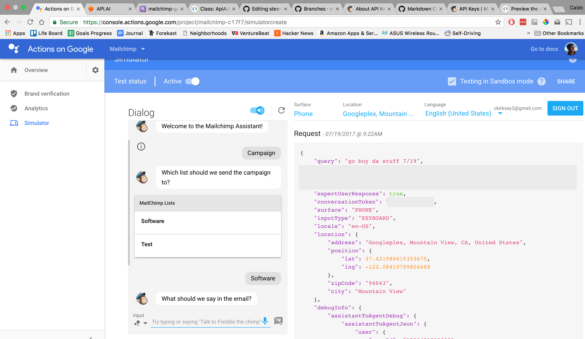

# Kallen Hiking App for the Google Assistant

## Usage
Instructions for running the app yourself with Heroku.

### Clone the repo
```bash
git clone git@github.com:ckirksey3/kallen.git
cd kallen
```

### Create a Heroku app
Install [Heroku CLI](https://devcenter.heroku.com/articles/heroku-cli) if you haven't already and then create an app
```bash
heroku create
git push heroku master
```

### Create Google Actions project
1. Go to the [Actions on Google Developer Console](http://console.actions.google.com/).
1. Click on **Add Project**, enter **MailChimpAssistant** for the project name, and click **Create Project**.
1. In the Overview screen, click on **Use API.AI** and then **CREATE ACTIONS ON API.AI** to start building actions.
1. The API.AI console appears with information automatically populated in an agent. Click **Save** to save the agent.

### Restore cached settings into the API.AI agent
1. In the left navigation, click on the gear icon to the right of the agent name.
1. Click on the Export and Import tab.
1. Click **RESTORE FROM ZIP** and select the Mailchimp.zip file including in this repo
1. Type RESTORE in the text box, click **RESTORE**, then **DONE**.

### Set up fulfillment
1. In API.AI's left navigation, click **Fulfillment**
1. Move the **ENABLED** slider to the right
1. Get the Web URL of your Heroku app from CLI
```bash
heroku info
```
1. Enter that Web URL in the URL field
1. Click **SAVE**

### Preview the app

1. Click on **Integrations** in API.AI's left navigation, and move the slider bar for the Actions on Google card.
2. Click on the Actions on Google card to bring up the integration screen and click **UPDATE** and then **VISIT CONSOLE**. Back at the console, click **TEST**.
  * If you don't see a TEST button, you need to click on the AUTHORIZE button first to give API.AI access to your Google account and Actions project.
3. In the Test your Assistant app section of the integration screen, click on the Actions Simulator link to open a new browser for the Actions simulator.
